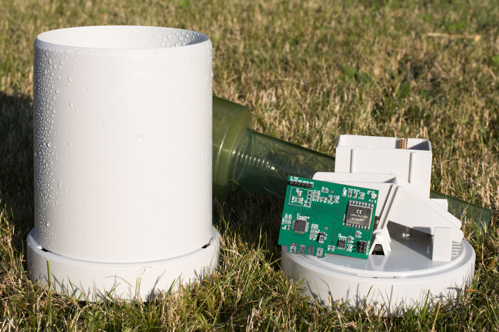

# LoRa Rain Gauge Firmware

This repository contains the firmware that runs on an alternative circuit board for a TFA 30.3161 rain gauge (see [link](#further-information) at the bottom of the page for more information) which converts the device to 868MHz LoRaWAN technology.

The measurement data will be transmitted to a LoRaWAN gateway in range of the device (even in urban areas, 1 km can be covered without any problems) while the power consumption is really low, so batteries last for years.

A JavaScript payload decoder tested with TheThingsNetwork v3 and ChirpStack v4 is provided.



## Required parts

Besides of the assembled [LoRa Rain Gauge board](https://www.maltepoeggel.de/?site=lora-raingauge), the following tools are needed:

- USB serial adapter with 3.3V VCC and logic level for programming (e.g. FT232RL board)
- Atmel AVR ISP for bootloader burning (6-pin connector, 3.3V, USBASP or similar)

## Implementation

The processor on the main circuit board is an Arduino compatible Atmel ATMega328P. The project therefore utilizes the popular MCCI Arduino LMIC library for LoRa. For easy compilation and deployment, the PlatformIO toolchain is used.

The LoRaWAN implementation supports OTAA and ABP. Session data (e.g. session keys, frame counter) and the rainfall counter value will be stored in the SPI FRAM chip from time to time. That is done immediately after joining the network and also after each third data packet has been sent. The advantage of FRAM over flash memory is a much higher number of write cycles, but it is still a good idea to limit them a little bit.

After start-up, the device goes into sleep mode first. It wakes up either after the defined time interval or when the button is pressed (which is possible once per minute). If there is no valid session, it will try to join first. When the data packet has been sent, the microcontroller switches back to deep sleep, in which the power consumption drops to just 11µA. The timing of the deep sleep mode is realized by using the watchdog timer to wake up the microcontroller from power down mode every second, decrementing a counter variable containing the time period until the next transmission.

The pulses generated by the tipping bucket rain gauge are captured by a port change interrupt. This is necessary because most components of the microcontroller peripherals (including timer/counter) are inactive due to the deep sleep mode. The interrupt will wake up the controller for a short period of time to increment the rain counter. After that, it will continue with the next deep sleep cycle.

If a BMP280 sensor is connected, temperature and barometric pressure data is also included in the transmission.

Sleep interval and rain counter can be updated via downlink message. Simply use fPort 1 for the interval and fPort 2 for the counter value, both sent as an unsigned 16-bit integer (MSB first).

## Software prerequisites

This firmware uses the PlatformIO build system, which will handle all toolchain and dependency related stuff automatically. Please follow the guides on platformio.org to either install [PlatformIO core](https://platformio.org/install/cli) (for console operation) or [VS Code & PlatformIO](https://platformio.org/install/ide) (IDE). Then clone this repository and change to the correct directory.

## Burning the bootloader

Simply connect your USBASP to the 6 pin ISP connector on the board. Please make sure the programmer is set to 3.3V voltage, as the RFM95W is *not* 5V tolerant! After that, just execute ```pio run -t bootloader -e m328p_isp``` (or ```-e m328pb_isp``` for ATMega328PB) to program bootloader and fusebits. Afterwards the device can be easily programmed via a serial connection.


## Configuring the LoRaWAN keys & network stack

Copy the file [src/config.h.example](src/config.h.example) to src/config.h. Then uncomment either USE_OTAA or USE_ABP, create a new device on your LoRaWAN server and fill in the initial session data in config.h as described therein. You can find the required payload decoder in [docs/payload-decoder.js](docs/payload-decoder.js).

## Flashing the firmware

Once everything is configured, connect the USB serial adapter to the appropriate pin header. Then execute ```pio run -t upload``` (add ```-e m328pb``` for ATMega328PB) to program the firmware.

You might want to check the serial console for log messages by using the command ```pio device monitor```. The network will be joined immediately after power up. Measurement values will be transmitted every 15 minutes.

Once the LoRaWAN activation is completed, the session data is stored in FRAM and recovered at boot. A hash value of config.h is included to detect configuration changes and invalidate the current session, forcing the device to reactivate. Reactivation can also be forced by holding down the button in the battery compartment for a few seconds while inserting the batteries.

## Status LED

The LED on the circuit board will light up if a packet is being sent. It will blink if the OTAA activation fails.

## Further information

https://www.maltepoeggel.de/?site=lora-raingauge

## License

This firmware is released under the terms of the MIT license, see [LICENSE](LICENSE) file for details.
